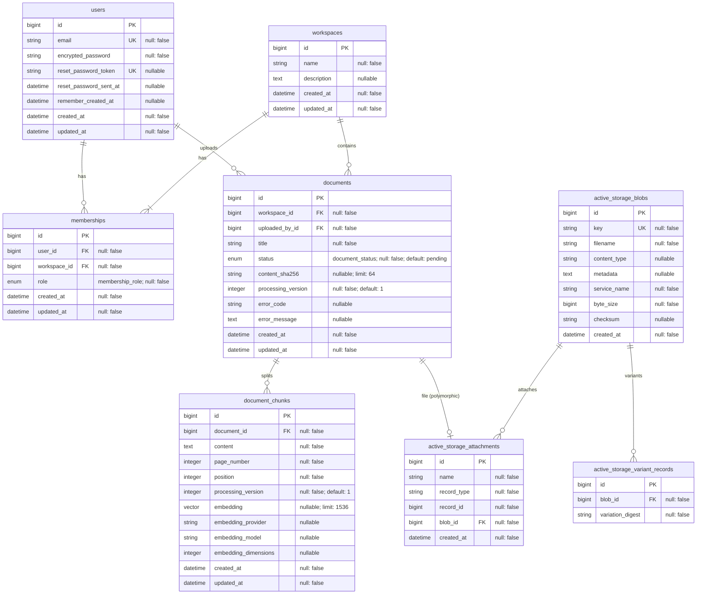

# Codexys ERD

ERD này phản ánh schema Rails/PostgreSQL sau khi chuyển authentication sang
Devise và dùng PostgreSQL native enum cho vai trò cùng trạng thái tài liệu.

## Enum types

- `membership_role`: `owner`, `admin`, `member`.
- `document_status`: `pending`, `processing`, `completed`, `failed`.

`memberships.role` vẫn là quyền theo từng workspace và độc lập với Devise.
Devise chỉ chịu trách nhiệm authentication. Bảng `sessions` tự viết đã được
loại bỏ; phiên đăng nhập mặc định được Devise/Warden quản lý bằng cookie.
