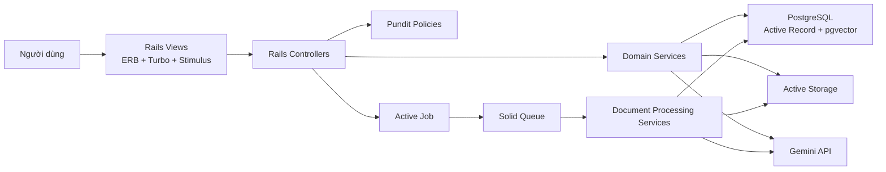
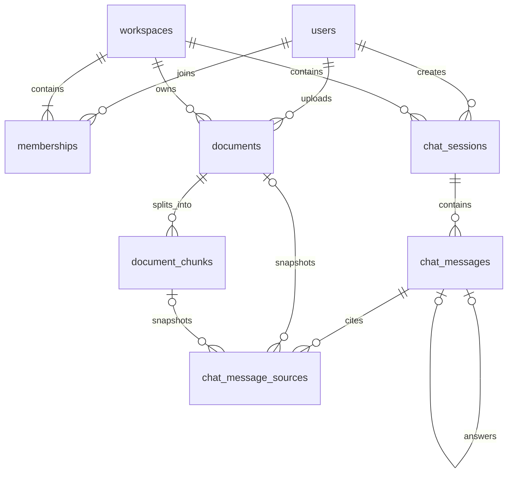
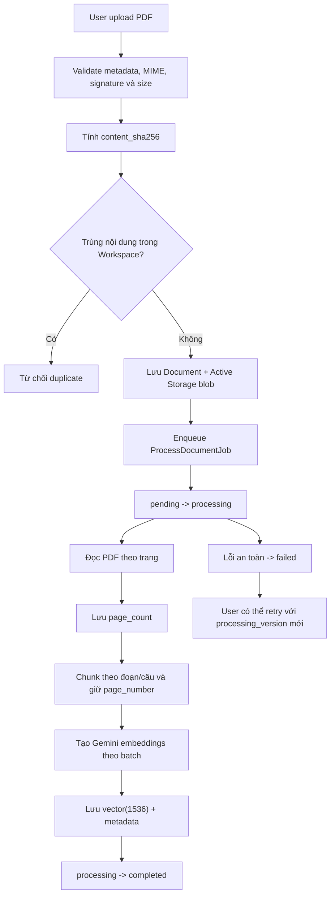
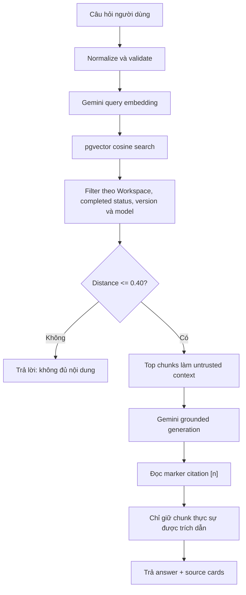

# Codexys - Tổng quan dự án, trạng thái hiện tại và kế hoạch tiếp theo

> Cập nhật ngày 06/08/2026, theo mã nguồn tại commit `c8f0b88`.
>
> Đây là tài liệu tổng hợp trạng thái thực tế của project. Khi nội dung trong
> roadmap cũ khác với tài liệu này, cần kiểm tra lại code và schema hiện tại
> trước khi quyết định.

## 1. Tóm tắt dự án

Codexys là ứng dụng quản lý và hỏi đáp tài liệu theo mô hình RAG, được xây dựng
bằng Ruby on Rails. Hệ thống cho phép nhiều người dùng cùng làm việc trong các
Workspace nhưng vẫn cách ly dữ liệu giữa các Workspace.

Người dùng tải tài liệu PDF lên. Hệ thống đọc nội dung, chia tài liệu thành các
đoạn nhỏ, tạo vector embedding và lưu vào PostgreSQL với pgvector. Khi người dùng
đặt câu hỏi, hệ thống tìm các đoạn gần nghĩa nhất, gửi những đoạn phù hợp cho
Gemini và trả về câu trả lời kèm nguồn tham khảo.

### Input chính

- Tài khoản người dùng.
- Workspace và thành viên của Workspace.
- Tài liệu PDF có text layer.
- Câu hỏi bằng ngôn ngữ tự nhiên.

### Output chính

- Tài liệu và trạng thái xử lý.
- Các đoạn tài liệu gần nghĩa với câu hỏi.
- Câu trả lời được tổng hợp từ tài liệu.
- Citation gồm tên tài liệu, số trang, vị trí chunk, đoạn trích và độ tương đồng.
- Lịch sử hỏi đáp nhiều lượt theo từng người dùng và Workspace.
- Báo cáo đánh giá retrieval dưới dạng JSON.

### Giá trị chính của đề tài

Codexys không chỉ tìm chuỗi ký tự giống nhau như keyword search. Hệ thống biểu
diễn nội dung tài liệu và câu hỏi thành vector, sau đó so sánh khoảng cách giữa
các vector để tìm nội dung gần nhau về nghĩa.

Ví dụ, tài liệu viết `Devise mã hóa mật khẩu trước khi lưu`, còn người dùng hỏi
`Hệ thống bảo vệ password như thế nào?`. Keyword search có thể không tìm thấy vì
từ ngữ khác nhau; semantic search vẫn có thể tìm đúng đoạn vì hai câu gần nghĩa.

## 2. Phạm vi phiên bản hiện tại

Phiên bản hiện tại tập trung vào luồng cốt lõi:

1. Đăng ký và đăng nhập.
2. Tạo Workspace và quản lý thành viên.
3. Upload PDF an toàn.
4. Xử lý PDF bằng background job.
5. Lưu embedding Gemini vào pgvector.
6. Semantic search có similarity threshold.
7. Hỏi đáp nhiều lượt có citation.
8. Lưu lịch sử, metadata AI và lỗi an toàn.
9. Đánh giá chất lượng retrieval.

Các tính năng chưa thuộc phạm vi lõi hiện tại:

- OCR cho PDF scan.
- Word, Excel, PowerPoint hoặc ảnh.
- Streaming câu trả lời.
- Hybrid search và re-ranking.
- Email invitation hoàn chỉnh.
- Dashboard system admin hoàn chỉnh.
- Audit log nghiệp vụ.
- Production deployment hoàn chỉnh.

## 3. Stack kỹ thuật

| Thành phần | Công nghệ hiện tại | Vai trò |
| --- | --- | --- |
| Backend | Ruby 3.4.x, Rails 8.1.x | Web application và nghiệp vụ |
| Database | PostgreSQL, pgvector | Dữ liệu quan hệ và vector search |
| ORM | Active Record | Model, validation, query và migration |
| Authentication | Devise | Đăng ký, đăng nhập, đăng xuất, reset mật khẩu |
| Authorization | Pundit | Policy theo user, Workspace và membership |
| File upload | Active Storage | Metadata và tệp PDF |
| PDF extraction | `pdf-reader` | Đọc text theo từng trang |
| Embedding | Gemini `gemini-embedding-001` | Vector 1.536 chiều |
| Generation | Gemini chat model | Sinh câu trả lời grounded |
| Vector query | `pgvector`, `neighbor` | Cosine nearest-neighbor search |
| Background jobs | Active Job, Solid Queue | Xử lý tài liệu ngoài web request |
| Frontend | ERB, Turbo, Stimulus | Server-rendered UI và tương tác nhẹ |
| Tests | Minitest, Capybara, Selenium | Model, service, policy, request và system test |
| Quality | RuboCop, Brakeman, Bundler Audit | Style và kiểm tra bảo mật |
| CI | GitHub Actions | Test, lint và security scan |

Project hiện là Rails monolith. Chưa có lý do cần tách microservice, React hoặc
Redis cho phiên bản đồ án hiện tại.

## 4. Kiến trúc tổng quan



### Quy ước phân lớp đang dùng

- Controller nhận request, xác định resource, authorize và gọi service.
- Model giữ association, validation, enum và invariant.
- Service giữ luồng nghiệp vụ, PDF processing, AI và RAG.
- Job nhận ID cùng processing version, sau đó gọi service.
- Policy là nguồn quyết định quyền truy cập.
- View chỉ render dữ liệu đã được controller chuẩn bị.

Chi tiết convention nằm tại [`CONVENTIONS.md`](CONVENTIONS.md).

## 5. Mô hình dữ liệu hiện tại

### Các bảng nghiệp vụ

| Bảng | Mục đích |
| --- | --- |
| `users` | Tài khoản Devise và system role |
| `workspaces` | Không gian chứa dữ liệu và cộng tác |
| `memberships` | Liên kết user với Workspace và workspace role |
| `documents` | Metadata, checksum, version và lifecycle của PDF |
| `document_chunks` | Nội dung từng chunk, trang, vị trí và embedding |
| `chat_sessions` | Phiên hỏi đáp của một user trong Workspace |
| `chat_messages` | Câu hỏi, câu trả lời, trạng thái và token usage |
| `chat_message_sources` | Snapshot citation bền vững của câu trả lời |
| `active_storage_*` | Blob, attachment và variant của Active Storage |

### Quan hệ chính



### Enum hiện tại

- `users.system_role`: `user`, `system_admin`.
- `memberships.role`: `owner`, `admin`, `member`.
- `documents.status`: `pending`, `processing`, `completed`, `failed`.
- `chat_messages.role`: `user`, `assistant`.
- `chat_messages.status`: `pending`, `completed`, `failed`.

`system_role` và `membership.role` giải quyết hai bài toán khác nhau:

- System role là quyền vận hành toàn bộ Codexys.
- Membership role là quyền của user trong từng Workspace.

Devise chỉ giải quyết authentication. Devise không tự tạo bảng role và không
thay thế `memberships`.

ERD chi tiết hiện có tại [`ERD.md`](ERD.md), nhưng cần đồng bộ lại trước khi đưa
vào báo cáo vì schema đã bổ sung `question_message_id`, `chunk_position` và các
mốc lifecycle sau lần cập nhật ERD trước.

## 6. Luồng xử lý tài liệu



### Cấu hình và giới hạn

- Dung lượng tối đa: 20 MB.
- Số trang tối đa: 100.
- Số chunk tối đa: 500 cho một processing version.
- Kích thước batch embedding: 64 chunk/request.
- Chunk tối đa: 1.200 ký tự.
- Overlap: 200 ký tự.
- Embedding: provider `google`, model `gemini-embedding-001`.
- Số chiều embedding: 1.536.

### Vì sao embedding nullable

Chunk được tạo trước, embedding được gọi sau. Nếu API Gemini lỗi giữa pipeline,
chunk có thể đã tồn tại nhưng chưa có vector. Vì vậy `embedding` cùng metadata
embedding được phép `NULL`. Database có check constraint bảo đảm metadata hoặc
cùng trống, hoặc cùng đầy đủ và đúng model 1.536 chiều.

### Idempotency và retry

- `content_sha256` phát hiện cùng nội dung trong một Workspace.
- `processing_version` phân biệt các lần xử lý.
- Job cũ không được ghi đè lần xử lý mới.
- Chỉ một job cho cùng document được chạy đồng thời.
- Retry không tạo chunk trùng vị trí trong cùng version.
- Network error, HTTP 429 và HTTP 5xx từ Gemini được retry có giới hạn.
- Lỗi PDF vĩnh viễn không bị retry vô hạn.

## 7. Luồng semantic search và RAG



### Điểm bảo mật quan trọng

- Vector search lọc theo `workspace_id` ngay trong candidate query.
- Chỉ dùng document có status `completed`.
- Chỉ dùng chunk thuộc processing version hiện tại.
- Chỉ dùng embedding đúng provider, model và dimensions.
- Nội dung tài liệu và lịch sử chat được coi là dữ liệu không đáng tin cậy.
- Prompt có giới hạn kích thước và ranh giới rõ giữa instruction với context.
- Không gọi generation nếu retrieval không có context đủ gần.

### Khi nào Gemini API được gọi

- Upload document: background job gọi embedding API theo batch.
- Mỗi semantic search: gọi một query embedding request.
- Nếu retrieval có context: gọi thêm generation request.
- Nếu không có context: không gọi generation.
- Mỗi câu hỏi chat mới cũng thực hiện retrieval mới; hệ thống không chỉ tổng hợp
  từ những câu trả lời cũ.
- Khi mở lại lịch sử đã lưu: không gọi Gemini; answer và citation được đọc từ
  database.

## 8. Chat nhiều lượt và citation bền vững

### Chat session

- Mỗi session thuộc đúng một user và một Workspace.
- User chỉ thấy lịch sử của chính mình.
- Câu hỏi tiếp theo dùng một lượng history gần đây có giới hạn.
- History hỗ trợ hiểu các câu hỏi nối tiếp như `còn đăng nhập thì sao?`.

### Ghép câu hỏi với câu trả lời

`chat_messages.question_message_id` nối một assistant message với đúng user
message mà nó trả lời. Unique index bảo đảm một câu hỏi chỉ có một answer hiện
tại. Cấu trúc này giúp retry đúng câu hỏi, không phụ thuộc vào vị trí record.

### Failure và retry

- Câu hỏi user được lưu trước khi gọi AI.
- Nếu generation timeout hoặc lỗi provider, câu hỏi không bị mất.
- Hệ thống lưu assistant message `failed` với `error_code` an toàn.
- User có thể retry; message chuyển `failed -> pending -> completed/failed`.
- Retry bị khóa để tránh hai request cùng claim một message.
- UI không hiển thị exception kỹ thuật hoặc API response nhạy cảm.

### Citation snapshot

Mỗi source lưu:

- `document_title`.
- `page_number`.
- `chunk_position`.
- `content`.
- `cosine_distance`.
- `rank`.
- Foreign key nullable tới document và document chunk.

Do có snapshot, citation cũ vẫn giải thích được khi document hoặc chunk gốc bị
xóa/reprocess. Source chỉ được lưu nếu câu trả lời thực sự dùng marker `[n]`.

## 9. Authentication, authorization và multi-tenancy

### Authentication đã hoàn thành

- Đăng ký.
- Đăng nhập.
- Đăng xuất.
- Remember me.
- Reset mật khẩu.
- Password lưu bằng `encrypted_password` của Devise.
- Session đăng nhập do Devise/Warden quản lý bằng cookie; không dùng bảng session
  tự viết trước đây.

### Workspace authorization đã hoàn thành

- User ngoài Workspace không đọc được resource bằng URL trực tiếp.
- Owner quản lý Workspace và thành viên.
- Admin có quyền quản lý theo policy đã định.
- Member chỉ thực hiện các hành động được policy cho phép.
- Một Workspace có tối đa một Owner ở database level.
- Owner không thể bị đổi role hoặc xóa trực tiếp.
- Document, chat session, chat message và vector retrieval đều được scope theo
  Workspace.

### System admin hiện tại

Cột `users.system_role` và enum `system_admin` đã có. Tuy nhiên chưa có dashboard,
controller và policy nghiệp vụ dành cho system admin. Hiện đây mới là nền dữ
liệu để triển khai quản trị toàn hệ thống sau.

## 10. Những phần đã hoàn thành theo phase

| Phase | Trạng thái | Nội dung đã đạt |
| --- | --- | --- |
| 0 - Setup | Hoàn thành | Rails/PostgreSQL/pgvector, WSL, migrations, project skeleton |
| 1 - RAG spike | Hoàn thành và đã productionize | Extract PDF, page-aware chunk, Gemini embedding, pgvector retrieval, grounded answer |
| 2 - Auth và Workspace | Hoàn thành phần lõi | Devise, Workspace CRUD, Membership, Owner/Admin/Member, Pundit, tenant isolation |
| 3 - Document management | Hoàn thành phần lõi | Upload/download/delete, validation, status, polling, retry, duplicate detection |
| 4 - Processing pipeline | Hoàn thành phần lõi | Solid Queue, lifecycle, versioning, idempotency, retry/backoff, resource limits |
| 5 - RAG và conversation | Gần hoàn thành | Semantic search, multi-turn chat, failure persistence, retry answer, citations |
| 6 - UI/UX | Đang làm | View chức năng đã có; visual design, responsive polish và system test chưa hoàn thành |
| 7 - Evaluation/security/operations | Hoàn thành một phần lớn | Retrieval dataset, metrics, baseline, rate limit, CI, RuboCop, Brakeman, audit |
| 8 - Advanced features | Chưa bắt đầu | Admin dashboard, feedback, audit log, invitations, hybrid search, OCR |
| 9 - Deployment/report | Chưa hoàn thành | Production storage, deployment, backup, README và báo cáo cuối |

## 11. Retrieval evaluation đã thực hiện

Dataset baseline gồm ba PDF, 12 câu answerable và ba câu unanswerable.

### Baseline được chọn

- Model: `gemini-embedding-001`.
- Dimensions: 1.536.
- Top K: 5.
- Max cosine distance: `0.40`.
- Hit Rate@5: 91,7%.
- MRR@5: 0,875.
- No-answer accuracy: 100%.
- Overall accuracy: 93,3%.
- PostgreSQL vector search P95: 196,4 ms.

Ngưỡng `0.65` đạt Hit Rate 100% nhưng nhận cả ba câu unrelated là có đáp án.
Ngưỡng `0.40` được chọn vì loại false positive tốt hơn, dù miss một câu
answerable.

Chi tiết nằm tại [`RETRIEVAL_BASELINE.md`](RETRIEVAL_BASELINE.md).

Chạy evaluation:

```bash
WORKSPACE_ID=7 \
DATASET=config/rag_evaluation.yml \
K=5 \
CONFIRM_AI_COST=1 \
bin/rails rag:evaluate
```

Evaluation hiện đo retrieval, chưa đo đầy đủ chất lượng câu trả lời do generation
model tạo ra.

## 12. Testing và quality gates hiện tại

Đã có test cho:

- Model validations, enum và database invariant.
- Devise authentication.
- Workspace và membership authorization.
- Cross-workspace access.
- PDF upload, validation và duplicate detection.
- Extraction, chunking, embedding và processing lifecycle.
- Job retry, stale version và concurrency behavior.
- Query embedding và vector retrieval.
- No-answer threshold.
- Prompt bounding và prompt-injection hardening.
- Chat history, message lifecycle, retry và citation snapshot.
- Retrieval evaluation dataset và metrics.

Các lệnh phải chạy trước khi merge/release:

```bash
bin/rails test
bin/rubocop
bin/brakeman --no-pager
bin/bundler-audit check --update
```

CI hiện chạy test, RuboCop, Brakeman, Bundler Audit và Importmap Audit.

Khoảng trống lớn nhất của testing hiện tại là chưa có system test cho toàn bộ
kịch bản demo trên trình duyệt.

## 13. Cấu hình và lưu trữ

### Development hiện tại

- PostgreSQL giữ record nghiệp vụ, chunk và vector.
- Active Storage giữ metadata trong PostgreSQL.
- File PDF thật nằm trong thư mục `storage/` khi dùng service `local`.
- Solid Queue dùng database queue riêng trong development.
- API key lấy từ `GEMINI_API_KEY` hoặc Rails credentials.

Biến môi trường hiện có:

```text
GEMINI_API_KEY
GEMINI_CHAT_MODEL
GEMINI_TIMEOUT_SECONDS
GEMINI_GENERATION_TIMEOUT_SECONDS
GEMINI_MAX_RETRIES
SEMANTIC_SEARCH_MAX_COSINE_DISTANCE
```

### Production cần thay đổi

Production hiện vẫn cấu hình Active Storage `local`. Cấu hình này không an toàn
trên nền tảng có filesystem tạm thời vì file có thể mất sau deploy/restart.

Kiến trúc production cần:

- Managed PostgreSQL có extension pgvector.
- Object storage S3-compatible như AWS S3 hoặc Cloudflare R2.
- Web process chạy Rails/Puma.
- Worker process chạy `bin/jobs`.
- HTTPS và secure cookies.
- SMTP cho reset password.
- Backup database và retention cho object storage.

Railway hoặc Render phù hợp với kiến trúc Rails có web process và worker hơn
mô hình serverless function thuần. Vercel không phải lựa chọn ưu tiên cho cấu
trúc hiện tại.

## 14. Các giới hạn và technical debt đang biết

1. UI hiện mới ở mức chức năng; visual design sẽ được thiết kế lại bằng Figma.
2. Chưa có system test cho user journey đầy đủ.
3. `README.md` vẫn là nội dung mặc định của Rails.
4. `docs/ROADMAP.md` còn ghi authentication generator trong khi code đã dùng
   Devise.
5. `docs/ERD.md` chưa phản ánh đầy đủ các cột chat/lifecycle mới nhất.
6. Chưa đo groundedness và citation correctness của câu trả lời generation.
7. Dataset evaluation còn nhỏ: 15 câu hỏi và ba PDF.
8. Chưa benchmark ở quy mô hàng nghìn tài liệu/chunk.
9. Generation vẫn chạy đồng bộ trong web request nên user có thể phải chờ API.
10. System admin mới có enum, chưa có use case quản trị.
11. Thêm member yêu cầu user đã đăng ký; chưa có invitation email.
12. Chỉ hỗ trợ PDF có text layer; chưa có OCR.
13. Production file storage, SMTP, host, SSL và deployment chưa cấu hình xong.
14. Chưa có error tracking, dashboard job và báo cáo AI usage dài hạn.

## 15. Kế hoạch tiếp theo được khuyến nghị

Không cần làm mọi phase hoàn toàn tuần tự. Tuy nhiên, task có dependency phải
được thực hiện đúng thứ tự. Ví dụ phải có Figma và component contract trước khi
viết lại toàn bộ CSS, và phải có production storage trước khi demo deployment.

### Phase 6A - Thiết kế UI trên Figma

Người phụ trách chính: chủ dự án.

#### Task 6A.1 - Chốt sitemap và user flow

Thiết kế các flow:

1. Đăng ký hoặc đăng nhập.
2. Tạo/chọn Workspace.
3. Quản lý thành viên.
4. Upload tài liệu.
5. Theo dõi `pending`, `processing`, `completed`, `failed`.
6. Semantic search và no-answer state.
7. Chat nhiều lượt, citation và retry.
8. Xóa session/document/Workspace.

Hoàn thành khi mọi route hiện tại có vị trí rõ trong sitemap.

#### Task 6A.2 - Tạo design system

Figma cần có:

- Color tokens.
- Typography scale.
- Spacing scale.
- Border radius và shadow.
- Grid desktop/tablet/mobile.
- Button variants.
- Input, textarea, select và file upload.
- Alert, flash, empty state và loading state.
- Status badge và role badge.
- Card, table, modal/confirmation.
- Chat bubble, answer card và citation card.

Hoàn thành khi màn hình mới được dựng chủ yếu từ component, không copy từng
element rời rạc.

#### Task 6A.3 - Thiết kế đầy đủ các state

Mỗi màn quan trọng phải có:

- Empty.
- Loading/submitting.
- Success.
- Validation error.
- Permission denied.
- Provider timeout/rate limit.
- Mobile layout.

Đặc biệt cần thiết kế riêng bốn trạng thái document và ba trạng thái assistant
message.

### Phase 6B - Implement UI từ Figma

Chỉ bắt đầu khi các màn core trong Figma đã được chốt.

#### Task 6B.1 - Application shell

- Layout, header, navigation, flash và footer.
- Skip link và keyboard focus.
- Design tokens trong CSS.
- Shared components/partials.

#### Task 6B.2 - Authentication và Workspace UI

- Devise views tùy chỉnh.
- Workspace index/show/new/edit.
- Membership management và role states.

#### Task 6B.3 - Document UI

- Document list responsive.
- Upload form.
- Processing status polling.
- Detail metadata.
- Retry và danger zone.

#### Task 6B.4 - Semantic search và chat UI

- Search form và empty state.
- Answer/no-answer/error state.
- Citation cards.
- Chat history, message bubble, pending/failed/completed và retry.

#### Task 6B.5 - Accessibility và responsive audit

- Một `h1` và một `main` hợp lý trên mỗi trang.
- Mọi control có label.
- Không duplicate ID.
- Focus visible và thứ tự tab hợp lý.
- Không chỉ dùng màu để truyền trạng thái.
- Không tràn ngang ở 360 px.
- Tôn trọng `prefers-reduced-motion`.

#### Task 6B.6 - System test cho demo flow

Ít nhất cần system test:

1. User đăng nhập và tạo Workspace.
2. Owner thêm member và đổi role.
3. User upload PDF và thấy trạng thái xử lý.
4. User semantic search và mở citation.
5. User tạo chat, hỏi tiếp và xem history.
6. Assistant failure được retry.

Không gọi Gemini thật trong CI; dùng fake client/job result.

### Phase 7A - Đánh giá chất lượng câu trả lời

Retrieval đã có baseline; bước tiếp theo là đánh giá generation.

#### Task 7A.1 - Mở rộng evaluation dataset

- Tối thiểu 30-50 câu hỏi.
- Tối thiểu năm tài liệu.
- Có factual, paraphrase, multi-hop và unrelated.
- Version dataset trong Git.

#### Task 7A.2 - Groundedness rubric

Mỗi answer chấm thủ công hoặc bán tự động:

- `0`: có claim không được source hỗ trợ hoặc trả lời sai.
- `1`: phần lớn đúng nhưng thiếu/không rõ nguồn.
- `2`: mọi claim chính được source hỗ trợ.

#### Task 7A.3 - Citation correctness

Đo:

- Citation precision: nguồn được dẫn có thật sự hỗ trợ claim không.
- Citation coverage: claim quan trọng có citation không.
- Citation validity: marker có map đúng source không.
- No-answer behavior: không bịa khi tài liệu thiếu dữ liệu.

#### Task 7A.4 - Báo cáo so sánh

So sánh ít nhất một biến:

- Chunk size/overlap.
- Cosine threshold.
- Top K.
- Prompt version.

Không thay nhiều biến trong cùng một lần chạy.

### Phase 7B - Observability và vận hành

#### Task 7B.1 - Structured logging

Log ID và timing, không log API key/toàn bộ tài liệu:

- `request_id`.
- `user_id`, `workspace_id`, `document_id`.
- `job_id`, `processing_version`.
- Embedding/generation duration.
- Vector query duration.
- Provider error class.

#### Task 7B.2 - AI usage reporting

- Tổng prompt/candidate token theo user và Workspace.
- Số query embedding/generation.
- Số lỗi/rate limit.
- Không cần billing phức tạp trong bản đầu.

#### Task 7B.3 - Background job visibility

- Hiển thị processing duration và retry count cần thiết.
- Theo dõi failed job.
- Có runbook xử lý document kẹt ở `processing`.

#### Task 7B.4 - Performance benchmark

- Benchmark với số chunk lớn hơn dataset demo.
- Đo riêng query embedding, PostgreSQL và generation.
- Kiểm tra HNSW index được dùng bằng `EXPLAIN ANALYZE`.

### Phase 8 - Tính năng nâng cao có chọn lọc

Chỉ chọn những tính năng phục vụ demo hoặc yêu cầu giảng viên/doanh nghiệp.

Ưu tiên đề xuất:

1. Feedback hữu ích/không hữu ích cho câu trả lời.
2. System admin dashboard cơ bản.
3. Audit log cho hành động quản trị.
4. Email invitation vào Workspace.
5. Khóa/mở tài khoản.

Chỉ cân nhắc sau khi đo baseline:

- Hybrid search.
- Re-ranking.
- Streaming.
- OCR.
- Thêm định dạng file.

Không nên thêm tất cả chỉ để tăng số lượng tính năng.

### Phase 9A - Production readiness

#### Task 9A.1 - Viết README hoàn chỉnh

README phải có:

- Yêu cầu hệ thống.
- Setup WSL/Ruby/PostgreSQL/pgvector.
- Biến môi trường.
- `db:prepare`.
- Chạy web và worker.
- Chạy test/security tools.
- Chạy evaluation.
- Kiến trúc file storage.

#### Task 9A.2 - Production database

- Chọn managed PostgreSQL hỗ trợ pgvector.
- Kiểm tra migration tạo extension.
- Quyết định cách cấp database cho primary/cache/queue/cable.
- Cấu hình connection pool theo web và worker concurrency.

#### Task 9A.3 - Object storage

- Bật Active Storage service S3-compatible.
- Cấu hình bucket private.
- Dùng signed download hoặc controller authorization hiện có.
- Kiểm tra xóa document xóa blob đúng mong đợi.

#### Task 9A.4 - Email và security production

- SMTP cho Devise reset password.
- `default_url_options` đúng domain.
- `force_ssl`, secure cookie và trusted hosts.
- Secret chỉ nằm trong environment/secret manager.

#### Task 9A.5 - Web và worker process

- Web: Rails/Puma.
- Worker: `bin/jobs`.
- Release command: `bin/rails db:prepare`.
- Health check: `/up`.
- Không xử lý embedding trong web process.

### Phase 9B - Deploy, backup và smoke test

- Deploy staging trước production.
- Upload PDF và chờ worker hoàn thành.
- Restart/redeploy rồi xác nhận PDF vẫn còn trong object storage.
- Chạy semantic search và chat.
- Kiểm tra citation link/download authorization.
- Kiểm tra reset password.
- Thiết lập database backup.
- Viết rollback và restore checklist cơ bản.

### Phase 9C - Báo cáo và demo đồ án

#### Nội dung báo cáo

1. Bài toán và mục tiêu.
2. Keyword search so với semantic search.
3. Kiến trúc Rails monolith.
4. ERD và multi-tenancy.
5. PDF processing pipeline.
6. Embedding và pgvector.
7. RAG, prompt và citation.
8. Authentication/authorization.
9. Evaluation methodology và baseline.
10. Bảo mật, giới hạn và lỗi.
11. Deployment.
12. Hạn chế và hướng phát triển.

#### Kịch bản demo đề xuất

1. Đăng nhập.
2. Mở Workspace và giới thiệu role.
3. Upload một PDF mới.
4. Theo dõi trạng thái đến `completed`.
5. Hỏi câu có đáp án và mở citation đúng trang.
6. Hỏi câu unrelated để chứng minh no-answer behavior.
7. Mở chat history và hỏi tiếp một câu có ngữ cảnh.

Chuẩn bị sẵn dữ liệu đã xử lý để demo vẫn tiếp tục được nếu Gemini hoặc mạng gặp
sự cố.

## 16. Thứ tự thực hiện ngắn gọn từ hiện tại

Thứ tự khuyến nghị:

1. Hoàn tất Figma cho toàn bộ core flow.
2. Implement UI và responsive/accessibility.
3. Viết system test cho demo flow.
4. Đánh giá groundedness/citation correctness.
5. Hoàn thiện logging và production configuration.
6. Chuyển file sang object storage.
7. Deploy staging với web + worker + pgvector.
8. Viết README, cập nhật ERD và roadmap.
9. Chốt báo cáo, slide và kịch bản demo.
10. Chỉ sau đó mới chọn thêm feature nâng cao.

## 17. Definition of Done cho các task tiếp theo

Một task chỉ được xem là hoàn thành khi:

- Happy path chạy được.
- Failure path quan trọng có UI rõ ràng.
- Pundit authorization đã được kiểm tra.
- Không truy cập chéo Workspace.
- Test liên quan xanh.
- Không gọi API thật trong CI.
- Không log secret hoặc toàn bộ tài liệu.
- Responsive và keyboard usable nếu có UI.
- Migration có index, foreign key và constraint phù hợp nếu có schema change.
- Tài liệu liên quan được cập nhật.
- Có một commit chỉ mô tả đúng mục đích task.

## 18. Các lệnh làm việc thường dùng

```bash
# Chuẩn bị database
bin/rails db:prepare

# Chạy development; Solid Queue có thể chạy cùng Puma theo cấu hình
bin/dev

# Chạy worker riêng
SOLID_QUEUE_IN_PUMA=false bin/dev
bin/jobs

# Quality gates
bin/rails test
bin/rubocop
bin/brakeman --no-pager
bin/bundler-audit check --update

# Kiểm tra routes và schema
bin/rails routes
bin/rails db:schema:dump
```

## 19. Tài liệu liên quan

- [`CONVENTIONS.md`](CONVENTIONS.md): quy ước code và kiến trúc.
- [`ERD.md`](ERD.md): ERD chi tiết, cần đồng bộ lại trước báo cáo.
- [`ROADMAP.md`](ROADMAP.md): roadmap gốc của dự án.
- [`TEST_CASES.md`](TEST_CASES.md): đặc tả test case.
- [`PHASE_6_BACKGROUND_JOBS.md`](PHASE_6_BACKGROUND_JOBS.md): Solid Queue.
- [`PHASE_7_AI_USAGE_GUARDRAILS.md`](PHASE_7_AI_USAGE_GUARDRAILS.md): giới hạn tài nguyên.
- [`PHASE_7_AI_REQUEST_RATE_LIMITING.md`](PHASE_7_AI_REQUEST_RATE_LIMITING.md): rate limit.
- [`PHASE_7_RETRIEVAL_EVALUATION.md`](PHASE_7_RETRIEVAL_EVALUATION.md): cách chạy evaluation.
- [`RETRIEVAL_BASELINE.md`](RETRIEVAL_BASELINE.md): số liệu baseline hiện tại.

